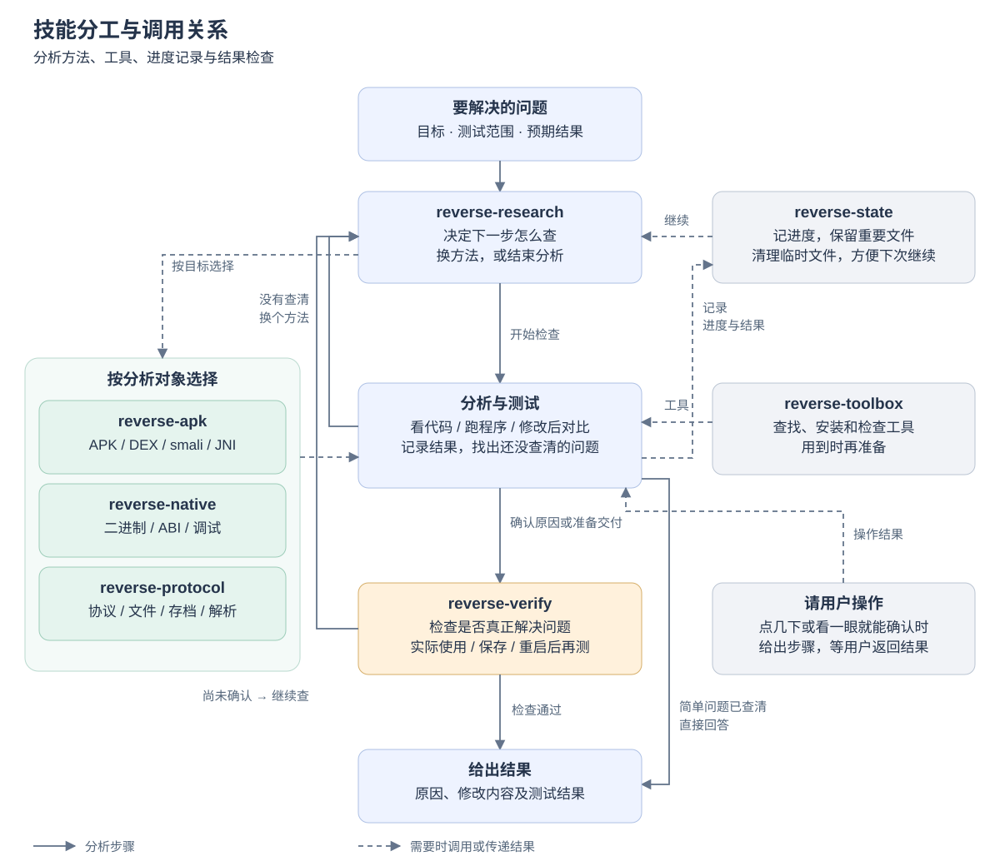

<div align="center">

# Reverse Research Skills

用于 Android、原生程序、协议与文件格式分析的 7 个 Codex 技能

**简体中文** · [English](README.en.md)

[为什么重写](#why) · [技能分工](#architecture) · [版本对比](#comparison) · [安装与使用](#start)

</div>

<a id="why"></a>

## 为什么重写

模型在不断变化，skill 里写死的流程却不会自己更新。步骤和检查点太多时，模型容易把时间花在走流程、填记录上，也可能放弃本来更合适的解法。

旧版把逆向工作拆成了 16 个技能。这一版合并为 7 个，主要提供分析方法、工具管理和验证要求，把具体怎么查、先查哪一步交给模型。重点减少几类常见问题：反复尝试同一种失败方法、没找到原因就修改、提前安装大量工具，以及把“能编译”“能解码”当成问题已经解决。

这样仍然可能限制模型，但在我的实际使用中，相近的 token、运行时间和人工投入下，新版的成功率和结果都比之前更好。目前还没有整理成可复现的对照测试，下面的对比主要说明设计上的差异。

对于已经授权的任务，先说清目标和操作范围，让模型把工作做完整，减少反复确认、含糊回答和不必要的拒绝。确实超出范围或缺少条件时，再说明具体原因。

<a id="architecture"></a>

## 技能分工

`reverse-research` 负责安排下一步，三个分析技能提供各自领域的方法。工具、进度记录和结果验证在需要时加入。简单的代码或文件问题可以直接回答。



| 技能 | 用途 |
|---|---|
| `reverse-research` | 安排分析步骤；连续失败时换方法；判断是否需要用户操作 |
| `reverse-apk` | 分析 APK/AAB、DEX/smali、JNI、Android 运行过程和重打包问题 |
| `reverse-native` | 分析原生程序、库和固件，处理 ABI、调试、内存写入与崩溃问题 |
| `reverse-protocol` | 分析协议、文件格式和存档，定位解析、序列化及数据校验问题 |
| `reverse-state` | 记录进度，保留重要文件，清理临时文件，方便下次继续 |
| `reverse-toolbox` | 查找、安装和维护工具，避免在不同项目里重复准备 |
| `reverse-verify` | 检查修改是否真正生效，以及重启、保存或实际使用后是否仍然有效 |

<a id="comparison"></a>

## 版本对比

以下比较同一模型、同类任务和相近预算下的预期表现，不是量化跑分。“不使用 skill”指不加载本仓库的技能。

| 项目 | 不使用 skill | 旧版 · 16 个技能 | 新版 · 7 个技能 |
|---|---|---|---|
| 开始分析 | 由模型自行决定 | 先分类，再进入相应流程；简单问题有快速路径 | 简单问题直接查，复杂问题再安排步骤 |
| 选择方法 | 灵活，但可能一直沿着最初的猜测查下去 | 按阶段维护假设、分析记录和验证结果 | 根据刚查到的结果决定下一步 |
| 连续失败 | 何时换方法取决于模型 | 通过假设和成本规则控制重试 | 同类尝试失败两次且没有新发现，就换方法 |
| 记录进度 | 可能很省事，也可能难以接续 | 复杂任务维护多份台账 | 分阶段或需要交接时才记录 |
| 准备工具 | 临时查找和安装 | 随平台模块和流程安排 | 用到哪个工具再准备哪个 |
| 用户操作 | 可能为了自动化花费过多时间 | 随整体流程安排 | 用户点几下更快时，给出具体步骤并等待结果 |
| 检查结果 | 好模型也能验证充分，但每次表现可能不同 | 有明确的证据和发布检查要求 | 根据要解决的问题检查实际结果 |
| 主要取舍 | 附加指令少，比较依赖模型自身能力 | 组织细致，流程和记录也更重 | 减少流程开销，但更依赖模型判断 |

### 例如：APK 存档导入失败

不使用 skill 时，模型可能直接找到原因，也可能看到一个可疑字段就开始修改。旧版会先判断问题复杂度，再安排定位、记录和验证。新版则先找出哪里拒绝了导入：涉及文件格式时用 `reverse-protocol`，涉及 Android 调用时用 `reverse-apk`。修改后检查能否导入、保存，以及重新启动后能否读取。

希望省下的是无效尝试和重复记录的成本。团队如果有固定的审计或交付要求，仍然需要在项目中写清楚。

<a id="start"></a>

## 安装与使用

将 `skills/` 下的 7 个文件夹复制到 Codex 用户技能目录，保留目录结构。已有同名技能时先备份，再替换。

旧版用户请看 [升级说明](UPGRADE_FROM_EXISTING_SKILLS.md)，文件列表见 [包清单](PACKAGE_MANIFEST.md)。

可以这样开始：

```text
使用 $reverse-research 和 $reverse-apk，分析这个 APK 的存档导入失败原因。
这是我有权测试的本地包，存档也由我提供。
先找到拒绝导入的位置，再决定是否修改。
如果做了修复，请检查导入、保存和重新启动后的读取情况。
```

两个辅助脚本需要 **Python 3.10+**。在仓库根目录查看用法：

```bash
python skills/reverse-state/scripts/state.py --help
python skills/reverse-toolbox/scripts/toolbox.py --help
```

<a id="scope"></a>

## 使用范围

本仓库仅用于经过授权的红队测试、安全研究及逆向分析。请遵守适用法律，在授权范围内使用。因违法、越权或滥用造成的后果，由使用者自行承担。
