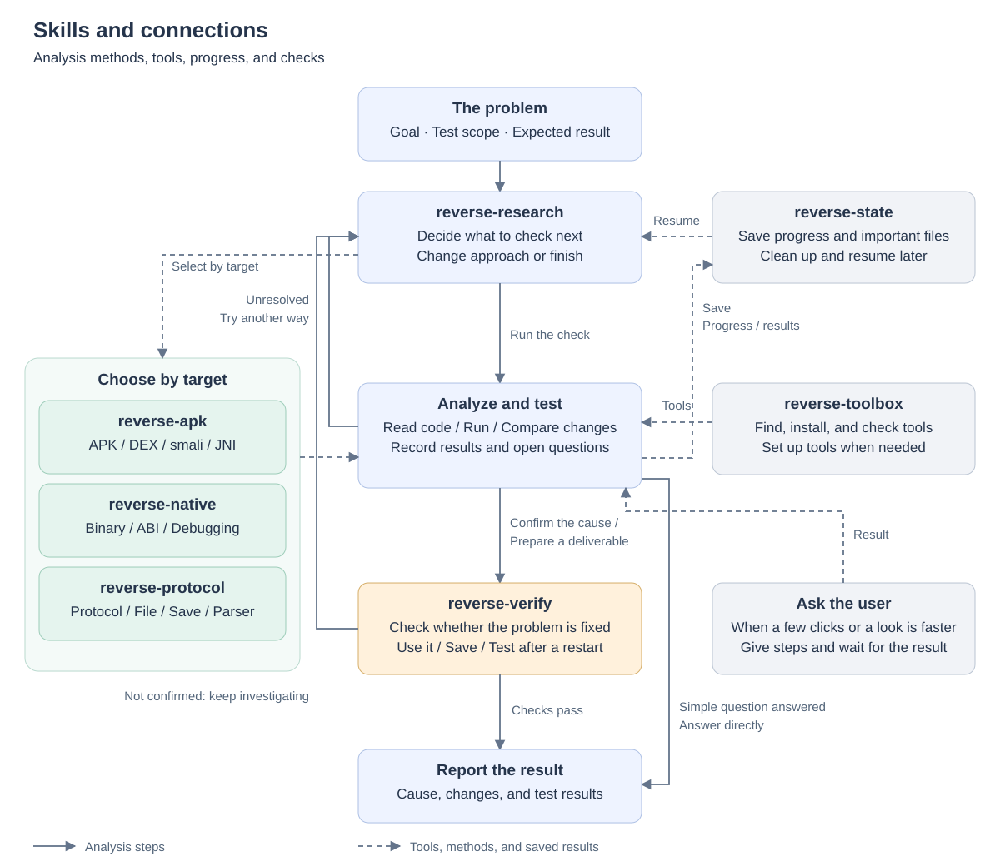

<div align="center">

# Reverse Research Skills

Seven Codex skills for Android, native binaries, protocols, and file formats

[简体中文](README.zh-CN.md) · **English**

[Why the rewrite](#why) · [Skills](#architecture) · [Comparison](#comparison) · [Getting started](#start)

</div>

<a id="why"></a>

## Why the rewrite

Models keep changing, but the procedures written into a skill do not update themselves. Too many steps and checkpoints can lead a model to spend time following procedures and filling in records, or to miss a better approach.

The previous version split reverse engineering into 16 skills. This version uses seven, covering analysis methods, tool management, and verification. The model decides what to investigate and in what order. The aim is to reduce repeated failed attempts, changes made before the cause is understood, unnecessary tool installation, and mistaking “it builds” or “it decodes” for a working fix.

These instructions may still limit the model. In my own use, though, the new version has produced better results and a higher success rate for similar token usage, runtime, and manual effort. I have not yet assembled reproducible comparison tests; the comparison below mainly describes the design differences.

For authorized work, stating the target and permitted operations should help the model complete the task with fewer repeated confirmations, vague answers, or unnecessary refusals. If an action is outside that scope or a requirement is missing, it should explain the specific issue.

<a id="architecture"></a>

## Skills

`reverse-research` decides the next step, while three analysis skills provide methods for their respective targets. Tools, progress tracking, and verification are used when needed. Simple code or file questions can be answered directly.



| Skill | Purpose |
|---|---|
| `reverse-research` | Plan the analysis, change approach after repeated failures, and decide when to ask for a user action |
| `reverse-apk` | Analyze APK/AAB, DEX/smali, JNI, Android runtime behavior, and rebuilding issues |
| `reverse-native` | Analyze programs, libraries, and firmware; investigate ABI, debugging, memory writes, and crashes |
| `reverse-protocol` | Analyze protocols, file formats, and saves; investigate parsing, serialization, and data validation |
| `reverse-state` | Save progress, retain important files, clean temporary files, and make work easier to resume |
| `reverse-toolbox` | Find, install, and maintain tools so each project does not repeat the setup |
| `reverse-verify` | Check whether a change works, including after restarting, saving, or using the affected feature |

<a id="comparison"></a>

## Comparison

These are expected differences for the same model, similar tasks, and comparable budgets, not benchmark scores. “No skills” means no skills from this repository.

| Area | No skills | Previous · 16 skills | Current · 7 skills |
|---|---|---|---|
| Getting started | The model decides | Classify the task and choose a workflow; simple questions have a fast path | Inspect simple questions directly; plan steps for complex work |
| Choosing an approach | Flexible, but may stick with an early guess | Track hypotheses, analysis, and checks by stage | Choose the next step from the latest findings |
| Repeated failures | The model decides when to change course | Hypothesis and cost rules limit retries | Change approach after two similar failures with no new findings |
| Progress records | Can be lightweight or hard to resume | Multiple ledgers for complex tasks | Record progress for staged work or handoff |
| Tool setup | Ad hoc discovery and installation | Arranged through platform modules and the workflow | Prepare a tool when it is needed |
| User actions | May spend too long automating a simple action | Arranged through the overall workflow | Give specific steps and wait when a few user clicks are faster |
| Checking results | Strong models can verify thoroughly, but consistency varies | Explicit evidence and release checks | Test the actual result relevant to the problem |
| Main tradeoff | Few extra instructions; relies on the model's own ability | Detailed organization, with more procedure and recordkeeping | Less procedural overhead, with more judgment left to the model |

### Example: an APK fails to import a save

Without skills, the model might find the cause directly or start changing a suspicious field too early. The previous suite first classifies the task, then arranges diagnosis, records, and verification. The current suite starts by finding where the import is rejected: use `reverse-protocol` for file-format issues and `reverse-apk` for Android calls. After a change, check importing, saving, and reading the save after a restart.

The intended savings come from fewer unhelpful attempts and duplicate records. Teams with fixed audit or delivery requirements should still document those requirements in the project.

<a id="start"></a>

## Getting started

Copy the seven folders under `skills/` into your Codex user skills directory, preserving their structure. Back up existing skills with the same names before replacing them.

See the [migration guide](UPGRADE_FROM_EXISTING_SKILLS.md) if upgrading, and the [package manifest](PACKAGE_MANIFEST.md) for the file list. Both documents are in Chinese.

Example request:

```text
Use $reverse-research and $reverse-apk to diagnose this APK's save import failure.
I am authorized to test this local package and have provided the save files.
Find where the import is rejected before deciding whether to change anything.
If you make a fix, check importing, saving, and reading the save after a restart.
```

The two helper scripts require **Python 3.10+**. From the repository root:

```bash
python skills/reverse-state/scripts/state.py --help
python skills/reverse-toolbox/scripts/toolbox.py --help
```

<a id="scope"></a>

## Use

This repository is for authorized red-team testing, security research, and reverse engineering only. Follow applicable laws and stay within your authorization. Users are responsible for the consequences of unlawful, unauthorized, or abusive use.
